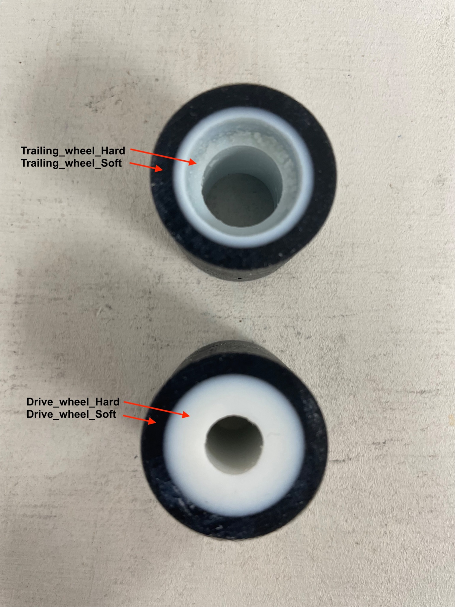
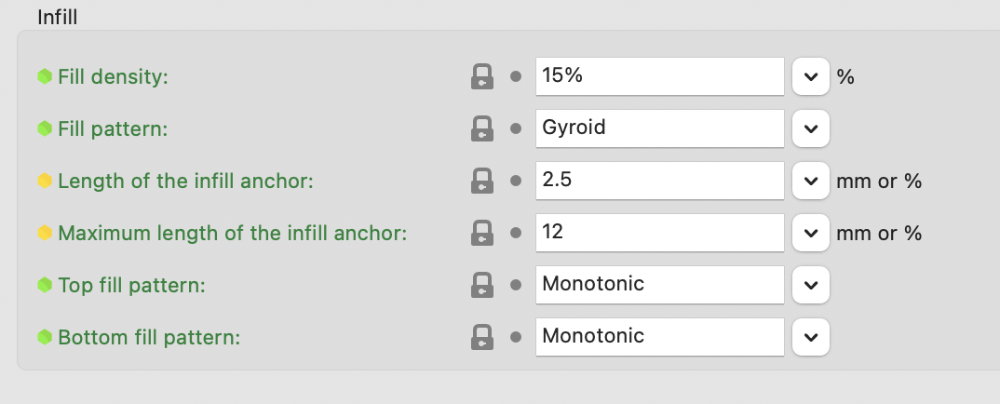

#What to consider when 3-D printing and laser cutting?
 
All 3D printing and laser cutting parts have their own folder, please download both folders for the correct files. You can either produce the parts yourself by going to a FabLab or university in your city – or order them online.
 
## FabLab

FabLabs are fabrication laboratories that offer small-scale personal fabrication tools. Here you can search for the closest FabLab worldwide: https://www.fablabs.io/labs/map. Make sure you are prepared, when going to a FabLab! Bring your USB stick with all files on both folders for 3-D and laser cutting. Call or email them ahead to get prices (material, time of usage, etc.), opening hours and support.
 
## Online

There are also online websites where you can send the files to print and produce the parts. They are a bit more expensive than doing it on the spot, but more convenient.  
3-D printing: https://www.shapeways.com/ ; https://i.materialise.com/en
Laser cutting: https://cotter.co

## Data files

The laser cutting parts are in eps format, we created them with Adobe Illustrator.
The 3-D files are in stl format and are compatible with any 3D printer, you will also find the machine drawing as Fusion file.

## 3D Printing

1. Polyjet
Polyjet printing enables you to choose from a wide range of mechanical properties—from flexible to rigid. The wheels are printed in two properties, the outside (black) in max. soft and the inside (white) in max. hardness 

		Suggested printer:
		Stratasys Objet260 Connex 3 

  

2. Filament
Printer: Original Prusa MK3S, Multimaker, Craftbot or similar
Material: PLA
Filament diameter: 1,75 mm
Infill: 15%

  

