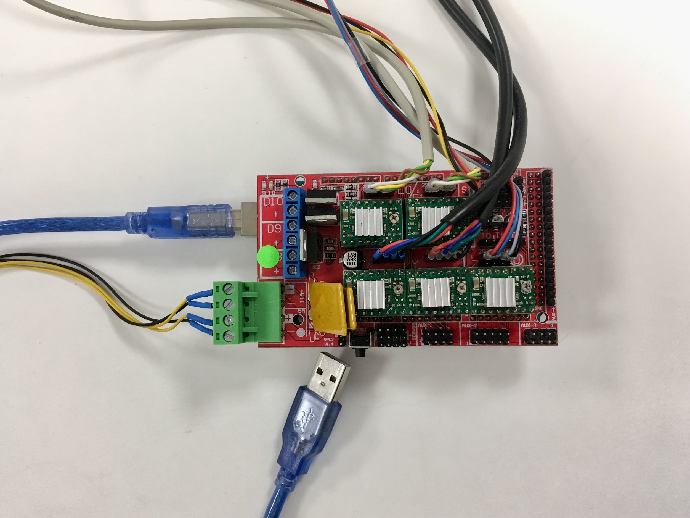
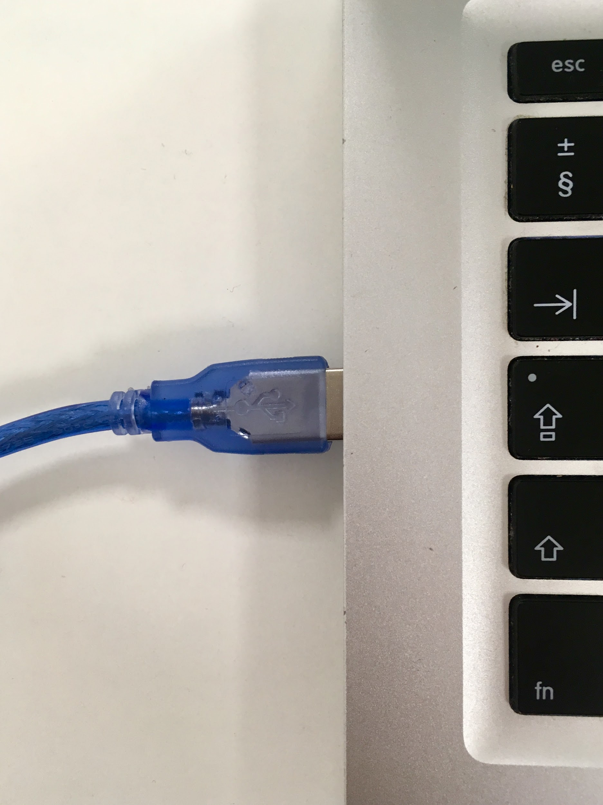
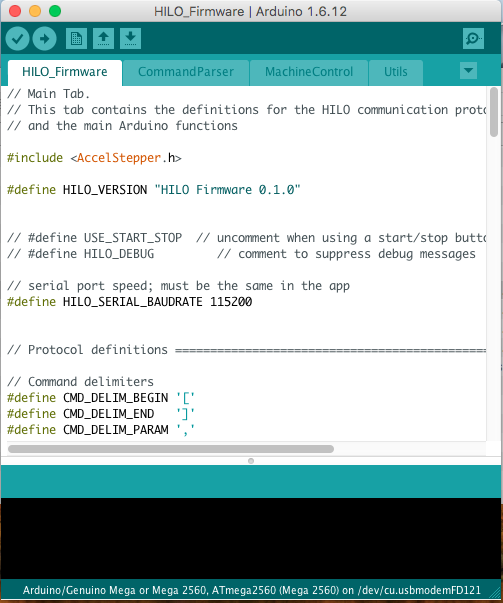
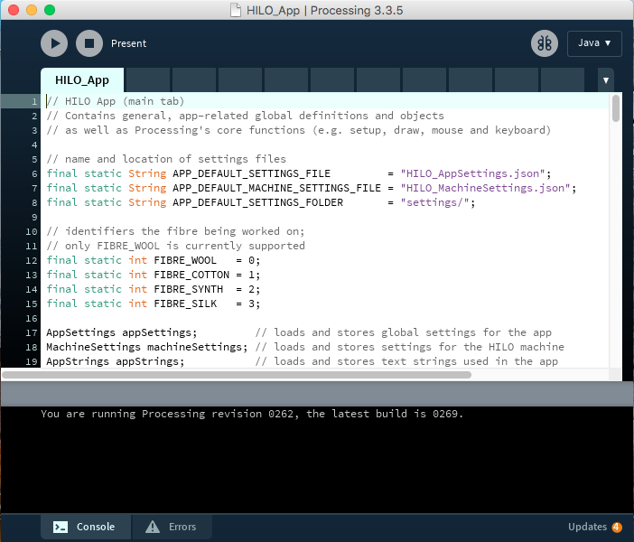
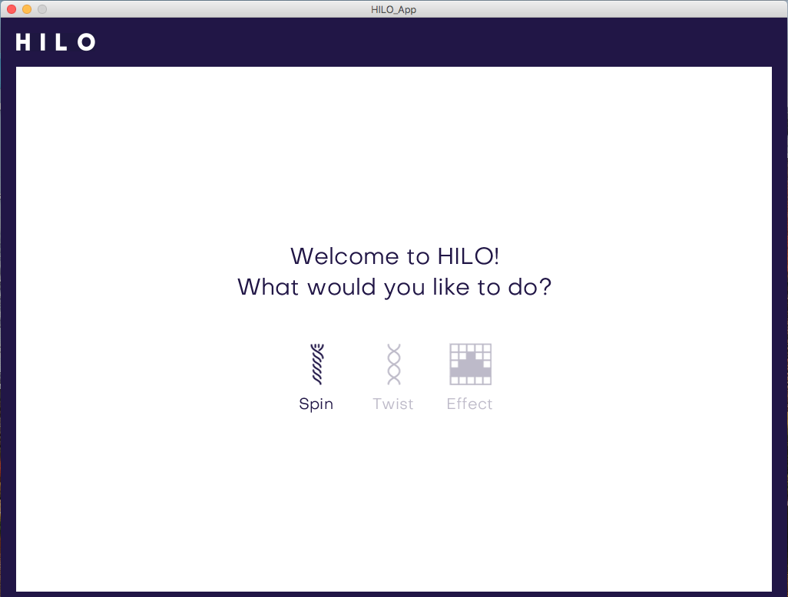
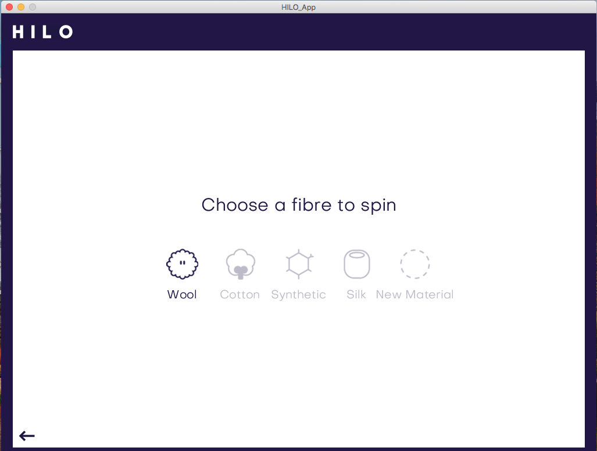
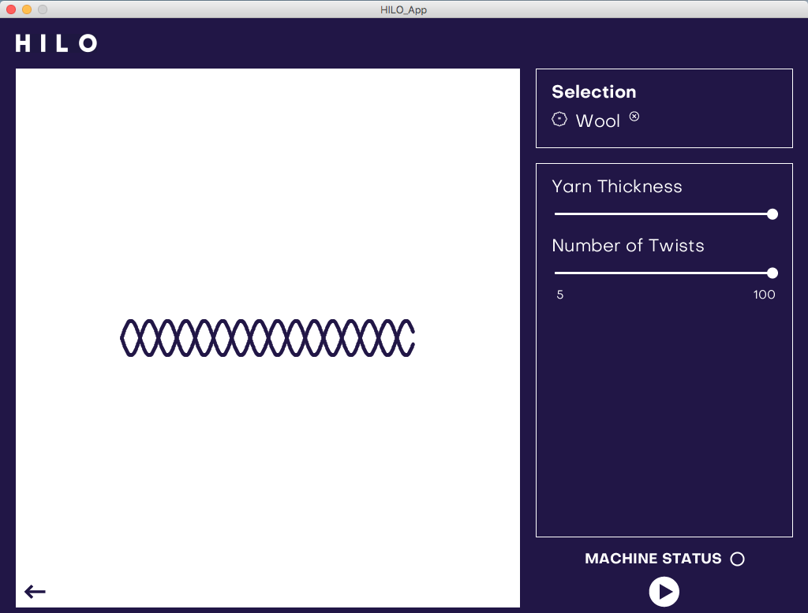
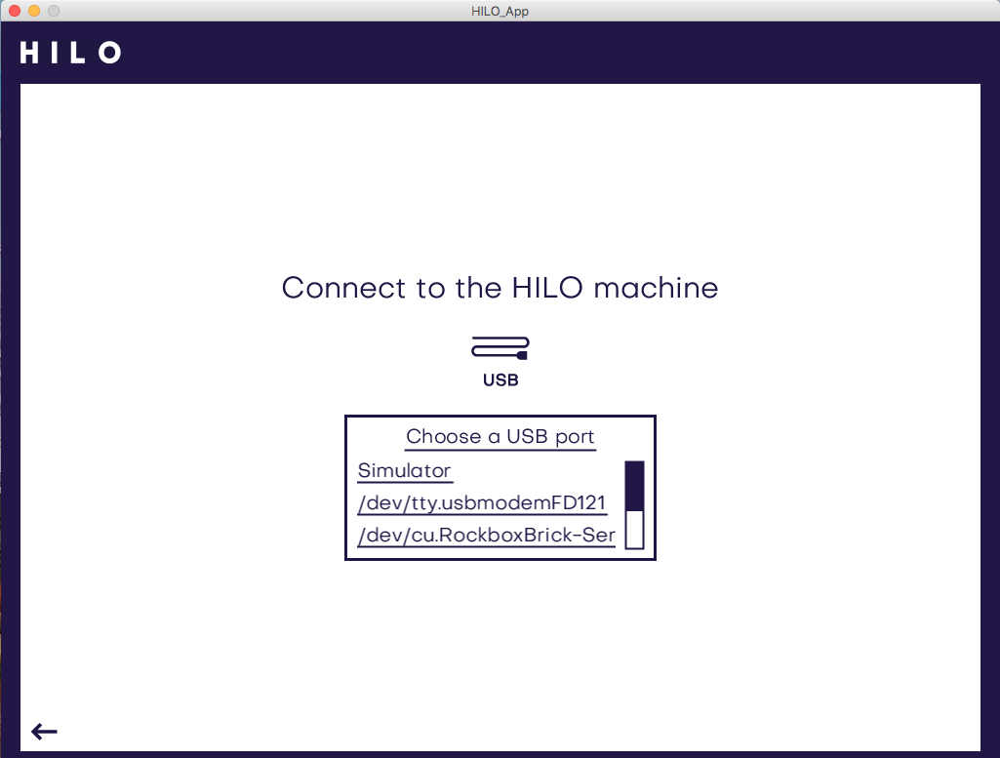

# What programs to download to run the HILO App? 

Please download the free programs “Processing” and “Arduino” on the following websites. We use them to run the HILO App and they are all connected with each other. 

* Processing: https://processing.org/download/
* Arduino: https://www.arduino.cc/en/Main/Software

## How to start with Arduino? 
After you follow the step by step electronic instructions you are ready to activate the Arduino Mega and upload HILO_App 

Follow the next steps →

    1. Connect the USB cable in the Arduino Mega Board and in the Computer  

  

  

    2. To Start with the Arduino software → open the HILO Firmware in the folder HILO_App  

    3. Please double click CommandParser.ino to open it →  

    4. Now you see all the four tabs of the HILO_Firmware in Arduino program   

  

    5. Go to tools → select the Arduino Board → Arduino/Genuio Mega or Mega 2560
 
    6. Go to tools → select the Port USBmodem→  

    7. Press on the play button to upload the Software in the Arduino (take’s some seconds to upload it!!). 
	   Once the Arduino is uploaded in our Mega board you don't have to do it again ;) 
	   It stays there forever till you upload another project on it.   

Remember to connect always the USB cable with the Arduino Mega Board and computer, as in picture 1 

    8. Please wait until the message Done uploading in the bottom of the window appears 

    9. You uploaded the code successfully and now you can close the Arduino in your computer and we will start with Processing.

## How to activate Processing? 
After you install Processing please follow the next steps to open the HILO_App →

    10. Remember to leave the USB connected in the Arduino Mega Board with the computer. 
	    To Start with Processing software → open the folder HILO_App in the folder HILO_App  

    11.  Double click on any document in the folder 

    12. The Processing software opens automatically and the Hilo_App opns in your computer→ 
	    please click on the run/play button to start the HILO App interface. (take’s a few seconds to open the app)

    13. A new window appears on your screen. 
		This is the HILO App, with this interface you can control the Spinning Machine and start spinning.

    14. Click on the word HILO to start the app →  

    15. You can select a working mode Spin or Twist→

    16. Choose the material of the fibers you want to spin → 

    17. In this adjustment preview you can set the yarn thickness and twist intensity in the sliders on the right menu. 
		You see a preview of your yarn in the left window. When ready to produce just press the PLAY button. →  

    18. The software will automatically ask you to connect to the HILO machine by USB. 
		Choose the USB port that contains “usbmodem” in the file name (e.g. /dev/tty.usbmodemFD121). → 

    19. After selecting the correct port you will come back to the adjustment preview from before. 
		Here you can change settings, produce and adjust directly by pressing PLAY and PAUSE.  → 

