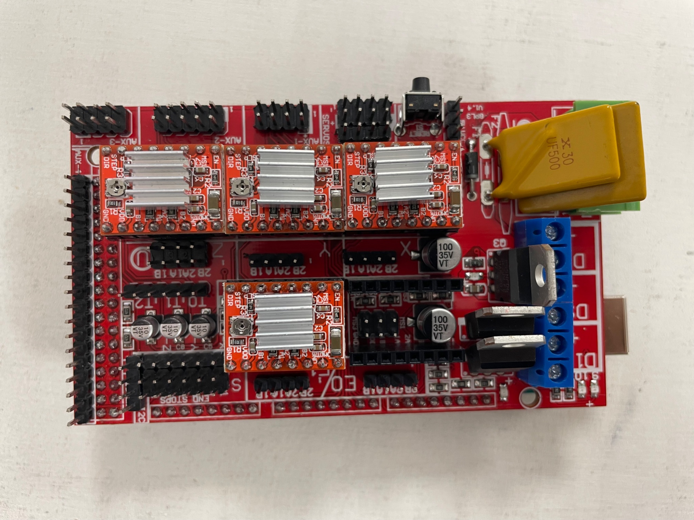

# Electronics 

In this scene you will connect all necessary components to make the HILO Spinning Machine work. In the electronic schematic and machine diagram you can see where and how the components are connected.

## Electronic Schematic

  

## Connection Diagram

  

    1. Microcontroller Arduino Mega 2560 & RAMPS 1.4

  
  

    2. Connect the RAMPS board to the Arduino board

  

    3. Glue the Heat Sink to each Driver Modules
 
  
  

    4. Connect the cables to the Stepper Motors 

  

    5. Connect the Driver Modules* to the board as you see in the image. 

  

    6. Connect Delivery Stepper Motor 1 to the Board

  

    7. Connect Delivery Stepper Motor 2 to the Board

  

    8. Connect Spindle Stepper Motor to the Board

  

    9. Connect Elevator Stepper Motor to the Board

  

    10. Connection of the power supply to the RAMPS 1.4 Board 

  
  

